# 294 / 295 - HyperByke

---

## Introduction

HyperByke is a management application intended for motorcycle garages, mainly used by mechanics and logistics personnel. Its goal is to optimize the management of motorcycle manufacturing, spare parts, and inventory. The application allows for real-time tracking of the progress of motorcycles currently being built, with a list of necessary parts and the ability to notify their assembly. Regarding the inventory, HyperByke handles the automatic updating of stock each time a part is consumed, ensuring a simplified and smooth management. Moreover, it allows placing orders to restock when a critical threshold is reached.

---

## Usage

Here is the link to the website: https://arnaudramirez.emf-informatique.ch/index.html

A Mechanic account / username: jdupont    password: pass1234

A Logistics account / username: mleblanc    password: securepass

### Run with Docker Compose (3 containers)

The project can be launched with 3 containers:
- client: Nginx serving the frontend
- server: Node.js/Express for the API
- mysql: MySQL database

Prerequisites:
- Docker Desktop installed and running

Start command:

```bash
docker compose up --build -d
```

Access:
- Frontend: http://localhost:8080
- Direct API: http://localhost:3000/api
- Swagger: http://localhost:8080/api-docs
- MySQL: localhost:3306

Stop:

```bash
docker compose down
```

Optional DB Configuration:
- Variables can be overridden via a .env file at the root (same level as docker-compose.yml)
- Supported variables: DB_USER, DB_PASSWORD, DB_NAME, JWT_SECRET, JWT_EXPIRATION
- DB_HOST is automatically configured on the mysql service in Docker Compose

## Analysis

### Use Case Diagram

#### Actors

- **User**: represents any person using the application before logging into an account.
- **Logistics Personnel**: responsible for inventory management and tracking spare parts.
- **Mechanic**: in charge of motorcycle production and assembly.

#### Use Cases

- **Create an account** and **Log in**  
  Accessible to all users to access the application.
- **Consult the home page**  
  Common entry point for all users.
- **Consult the list of parts remaining to be assembled**  
  Allows tracking the progress of production.
- **Consult the list of motorcycles in production**  
  Allows tracking the progress of production.
- **Add a motorcycle to production**  
  Feature reserved for logistics personnel and mechanics to manage manufacturing.
- **Consult one of the motorcycles in the production list**  
  Feature reserved for logistics personnel and mechanics to manage manufacturing.
- **Mark a part as assembled**  
  Allows notifying the progress of assembly.
- **Consult inventory**  
  Specific action for logistics personnel to ensure parts availability.
- **Modify inventory quantity**  
  Specific action for logistics personnel.
- **Place an inventory order**  
  Specific action for logistics personnel.

This structuring helps better visualize the responsibilities and rights of each actor in the HyperByke application.

---

### Mockups

Each mockup corresponds to a key feature:

- **Home page**: General view accessible to all users after login.
- **List of motorcycles in production**: Allows tracking the progress of ongoing manufacturing.
- **Motorcycle details**: Displays the necessary parts to assemble and their progress state.
- **Inventory management**: Reserved for logistics personnel to consult, modify, and order parts.
- **Adding a motorcycle to production**: Form to launch the manufacturing of a new motorcycle.
- **Login**: Secure access to the application.
- **Account creation**: Create a new account.

The following screenshots present these different screens:

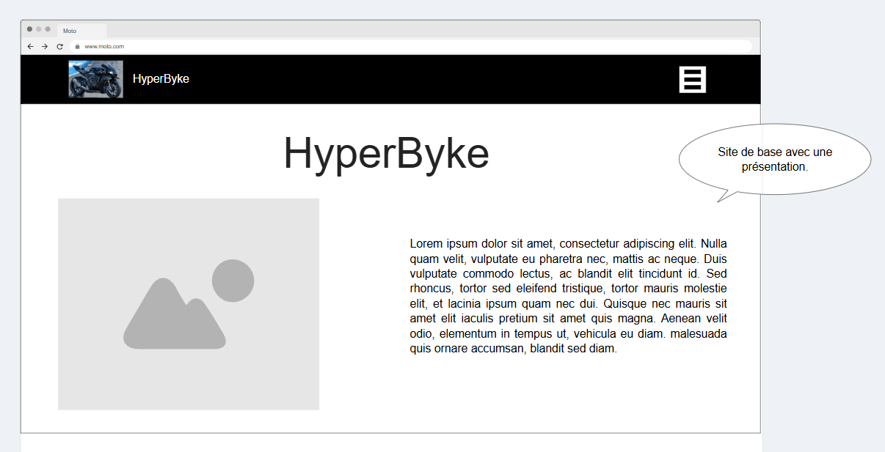

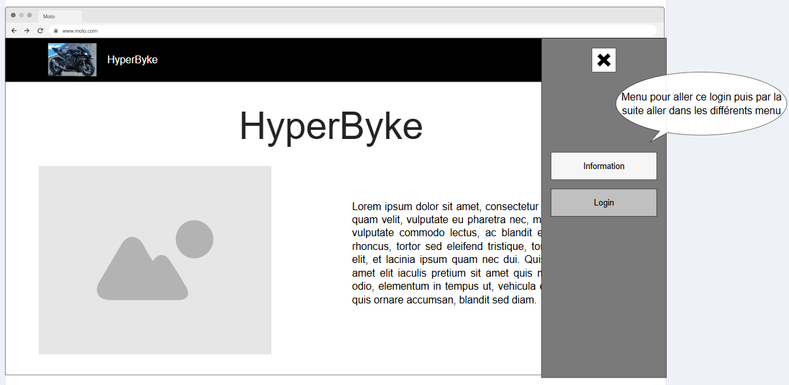

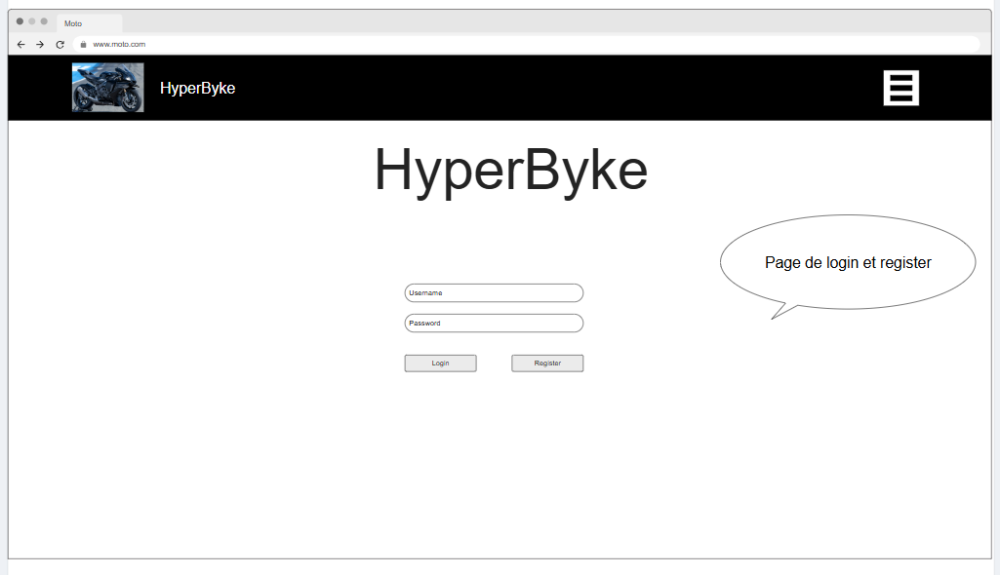

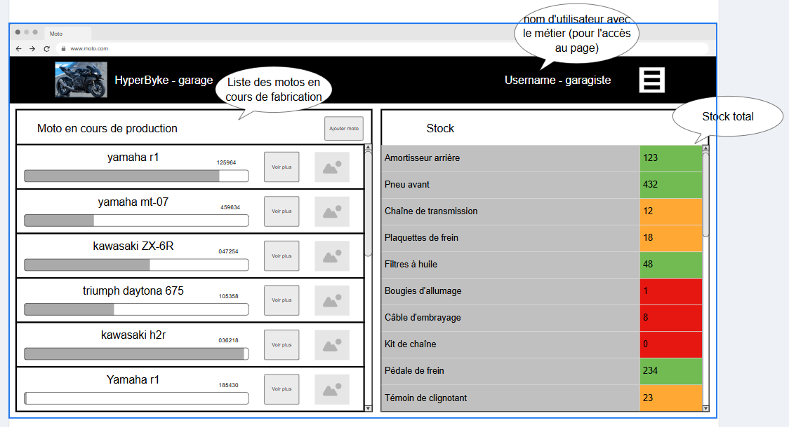

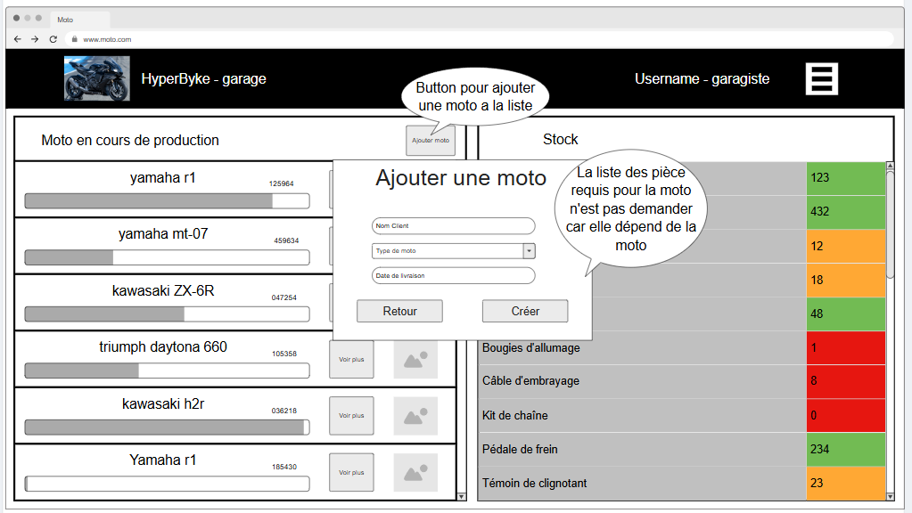

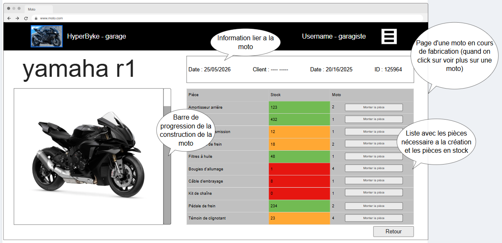

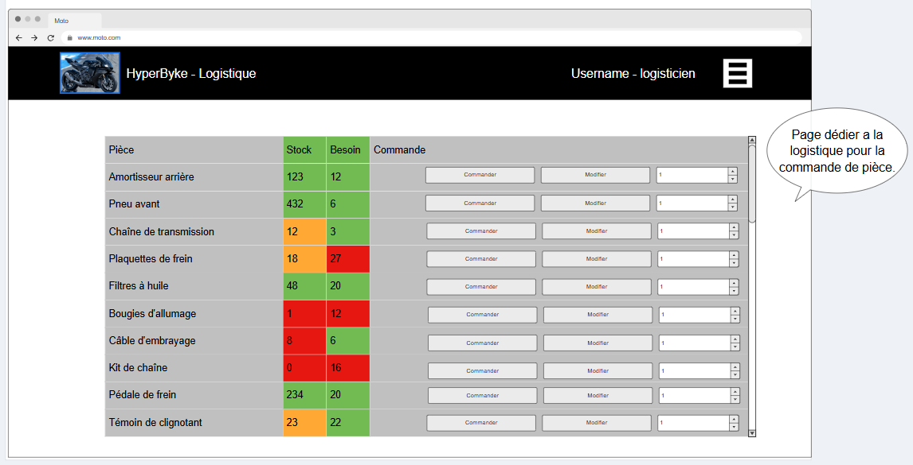

---

### Activity Diagram

Here is the Activity Diagram. It shows the connection with the client part, server, and the database:

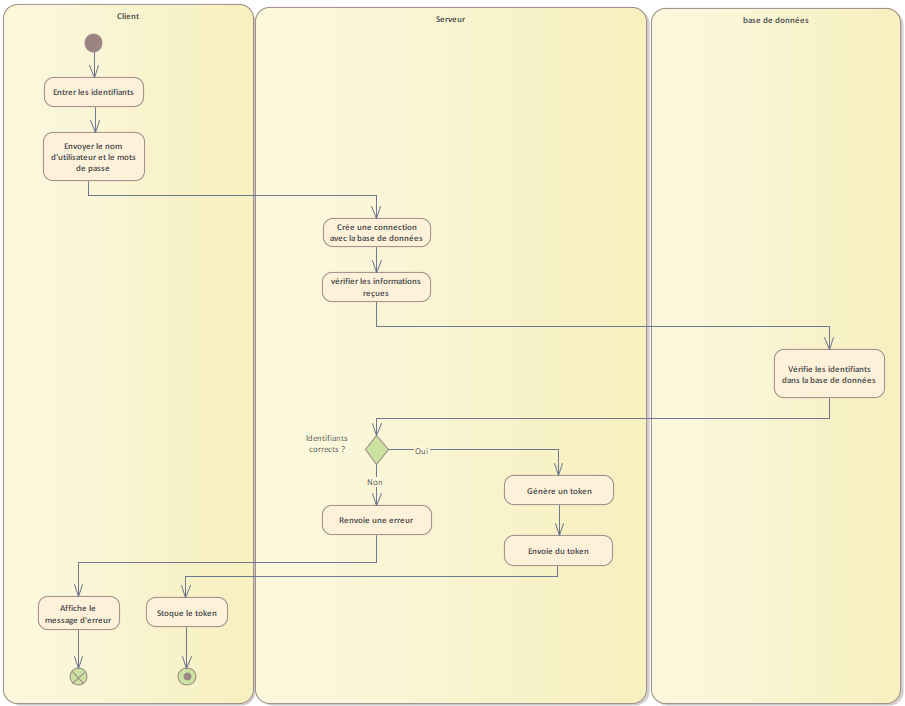

---

### ER Diagram

Here is the Entity-Relationship Diagram of the HyperByke database:

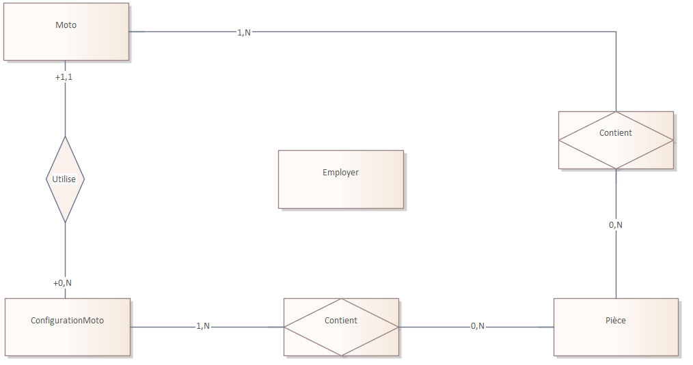

**Table Explanation**

- **ConfigurationMoto**: defines the necessary parts per type of motorcycle (model).
- **ConstructionMotoPiece**: records the parts actually used for a given motorcycle.
- **Moto**: actual motorcycle under construction or finished.
- **Piece**: parts inventory.
- **Employe**: with role (logistics or mechanic).

**Relations between entities**

- **Moto – ConstructionMotoPiece**
  - A motorcycle uses several parts for its construction.
  - Each record of a part used belongs to a single motorcycle.
- **Piece – ConstructionMotoPiece**
  - A part can be used in the construction of several motorcycles.
  - Each line of ConstructionMotoPiece refers to a single part.
- **ConfigurationMoto – Piece**
  - A motorcycle configuration references a necessary part for a model.
  - A part can be present in several motorcycle configurations.
- **ConfigurationMoto – Moto**
  - A configuration is linked to a generic motorcycle type (model).
  - A motorcycle type can have several configuration lines (one per necessary part).

---

## Design

### Client Class Diagram

Here is the Client Class Diagram, where all HTML files, controllers, and services can be found:

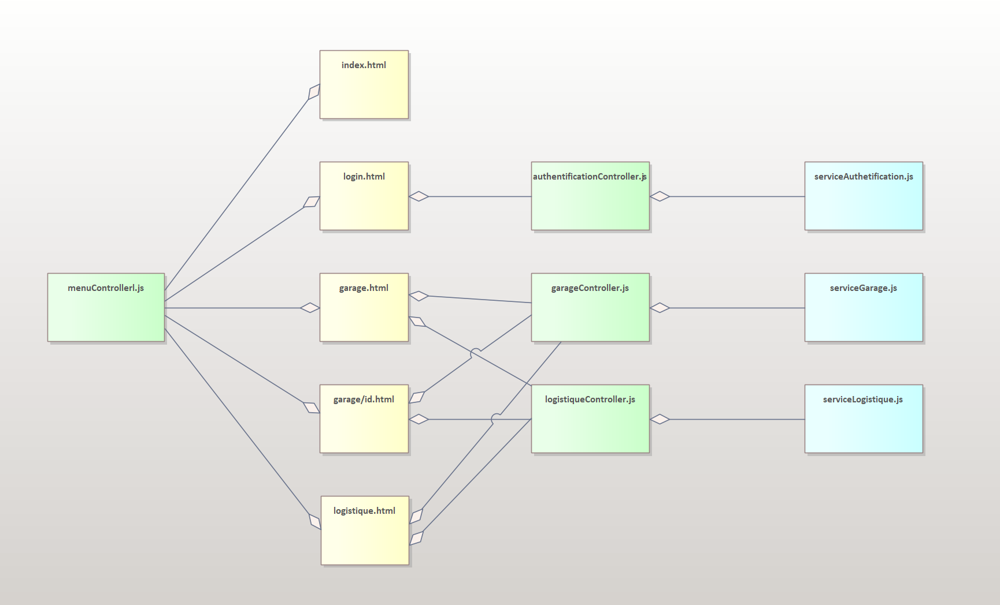

### Server Class Diagram

Here is the Server Class Diagram showing the general structure of the project with the different routes, services, and controllers.

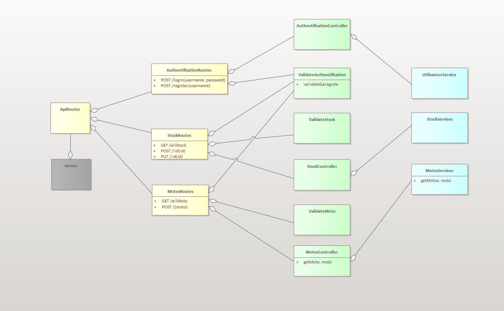

### Interaction Diagram

Here is the Interaction Diagram. It shows a mechanic who wants to display the list of motorcycles in production:

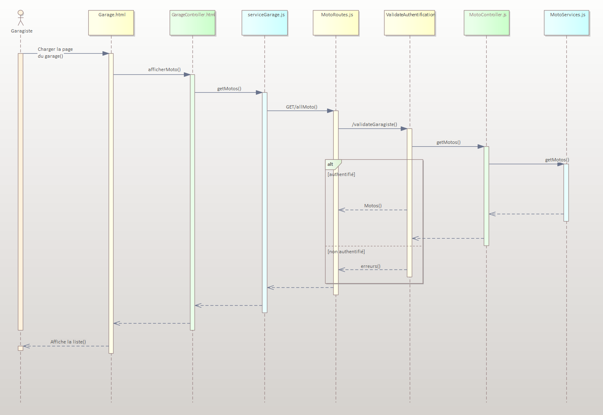

### Relational Schema

Here is the Relational Schema realized with MySQL. It shows the different tables.

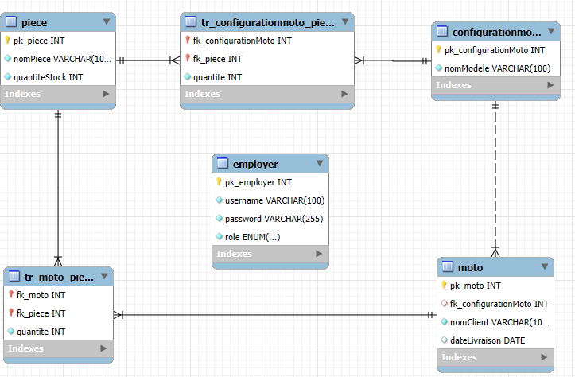

---

### Test Design

Here is the list of tests I will perform:

| No. | Date      | Objective / Tested Feature                                 | Main Steps / Method                                                                 | Expected Result                                      |
|-----|-----------|-------------------------------------------------------------------|---------------------------------------------------------------------------------------------|-------------------------------------------------------|
| 1   | 11.06.25  | Log in as a mechanic                               | Enter mechanic credentials, submit                                                      | Access to the mechanic interface, welcome message   |
| 2   | 11.06.25  | Log in as a logistics worker                             | Enter logistics credentials, submit                                                    | Access to the logistics interface, welcome message |
| 3   | 11.06.25  | Add to inventory (logistics)                                  | Go to the inventory page, click "Add", fill out the form, submit                   | New part added to inventory, confirmation         |
| 4   | 11.06.25  | Modify inventory quantity (logistics)                     | Go to the inventory page, select a part, modify quantity, submit                 | Quantity updated, confirmation displayed           |
| 5   | 11.06.25  | View motorcycle sub-page (mechanic)                         | Go to the motorcycle list, click on a motorcycle                                          | Details of selected motorcycle displayed           |
| 6   | 11.06.25  | Notify assembly of a part on a motorcycle (mechanic)        | On a motorcycle's details, click "Mark as assembled" on a part                 | Part marked as assembled, status updated        |
| 7   | 11.06.25  | Add a motorcycle to the motorcycle list (mechanic)               | Go to the add page, fill out the form, submit                                   | New motorcycle added to the list, confirmation        |
| 8   | 11.06.25  | Display the inventory (mechanic and logistics)                    | Go to the inventory page                                                                     | List of parts and quantities displayed correctly    |

---

## Implementation

### Code Walkthrough

_You describe and explain an actionable process in your application. You can in particular take one of the cases from your use case diagram. You explain all the steps from the client straight to the server and the database as well as the return to the client. Your explanations contain relevant code snippets – there is absolutely no point setting up all the code in your report! Use Markdown for your code extracts. On the client side, the code walkthrough illustrates the different elements of the MVC structure of your application, the interface elements, the various events, data validation, and their transmission to the server side. For the server, the code walkthrough must illustrate: routes, HTTP method used, return codes, JWT token verification, database access, server-side data validation._

### Code Walkthrough: Deleting a motorcycle

Let's take the example of the "Delete a motorcycle" use case for the mechanic. Here is the complete path of the request, from the client to the database, going through the server, with illustrative code snippets.

#### 1. Client side (mechanic)

In the interface, each motorcycle in the list has a "Delete" button:

```html
<!-- HTML excerpt for each motorcycle -->
<li>
  <span>Motorcycle name</span>
  <button class="btn-supprimer" data-id="1">Delete</button>
</li>
```

The JS controller handles the click event on the button:

```js
// Client side controller (example: client/controllers/motoController.js)
document.querySelectorAll('.btn-supprimer').forEach(btn => {
  btn.addEventListener('click', function() {
    const id = this.getAttribute('data-id');
    if (confirm('Do you really want to delete this motorcycle?')) {
      fetch(`/api/moto/${id}`, {
        method: 'DELETE',
        headers: {
          'Authorization': 'Bearer ' + token
        }
      })
      .then(res => {
        if (!res.ok) throw new Error('Deletion error');
        return res.json();
      })
      .then(() => {
        // Refresh the motorcycle list after deletion
        getAllMotos();
      })
      .catch(err => alert(err.message));
    }
  });
});

function getAllMotos() {
  fetch('/api/moto/allmotos', {
    headers: { 'Authorization': 'Bearer ' + token }
  })
    .then(res => res.json())
    .then(motos => afficherMotos(motos));
}

function afficherMotos(motos) {
  // Dynamically updates the list of motorcycles in the interface
}
```

#### 2. Express Route on the server side

In `server/app/routes/motoRoutes.js`:

```js
router.delete("/:id", validateAuthentification(['garagiste']), motoController.deleteMoto);
```

- The route `/api/moto/:id` is protected by the authentication and role middleware.

#### 3. Authentication Middleware

In `server/app/middlewares/validateAuthentification.js`:

```js
// ...existing code...
if (allowedRoles.length > 0 && !allowedRoles.includes(user.role)) {
    return res.status(403).json({ error: 'Access denied: insufficient role' });
}
// ...existing code...
```

#### 4. Motorcycle Controller

In `server/app/controllers/motoController.js`:

```js
const deleteMoto = async (req, res) => {
  try {
    await motoService.deleteMoto(req.params.id);
    res.status(200).json({ message: 'Motorcycle deleted' });
  } catch (error) {
    res.status(500).json({ error: 'Server error during deletion' });
  }
};
```

#### 5. Motorcycle Service

In `server/app/services/motoService.js`:

```js
const deleteMoto = async (id) => {
  const connexion = await pool.getConnection();
  try {
    await connexion.query('DELETE FROM Moto WHERE pk_moto = ?', [id]);
  } finally {
    if (connexion) connexion.release();
  }
};
```

#### 6. Return to client

After deletion, the client restarts the `getAllMotos()` function to refresh the list. The deleted motorcycle no longer appears in the interface.

---

### Difference between design and implementation

I find the project closer to the designed concepts, but there are some differences. On the client side, the motorcycle progress bar was not finalized in time, and I didn't have time to add colors in all tables to alert when values are low.

In my client, I have extra controllers that I had not planned for.
The server is very close to the design, I just had to add one or two GETs or POSTs.

### Encountered problems

I had a problem concerning the deletion of parts in the client: in the GET of a motorcycle in the parts list, I wasn't sending the PK, so I couldn't know the parts PK in order to use it in the request to assemble the part. I had to add this portion to the server.

I had a problem during the server hosting: I had bcrypt installed instead of bcryptjs, which caused an error.

Otherwise, I had no other major issues.

---

## Test Execution

Here are the tests performed:

| No. | Date      | Objective / Tested Feature                                 | Main Steps / Method                                                                 | Expected Result                                      | Status  | Comments / Conclusion                                                                                 | Visa              |
|-----|-----------|-------------------------------------------------------------------|---------------------------------------------------------------------------------------------|-------------------------------------------------------|-------|----------------------------------------------------------------------------------------------------------|-------------------|
| 1   | 11.06.25  | Log in as a mechanic                               | Enter mechanic credentials, submit                                                      | Access to the mechanic interface, welcome message   | ✅    | Successful login, interface fits the mechanic role.                                                  | Arnaud Ramirez    |
| 2   | 11.06.25  | Log in as a logistics worker                             | Enter logistics credentials, submit                                                    | Access to the logistics interface, welcome message | ✅    | Successful login, interface fits the logistics role.                                                | Arnaud Ramirez    |
| 3   | 11.06.25  | Add to inventory (logistics)                                  | Go to the inventory page, click "Add", fill out the form, submit                   | New part added to inventory, confirmation         | ✅    | Inventory addition successful, part visible in the list.                                                  | Arnaud Ramirez    |
| 4   | 11.06.25  | Modify inventory quantity (logistics)                     | Go to the inventory page, select a part, modify quantity, submit                 | Quantity updated, confirmation displayed           | ✅    | Modification accounted for, correct quantity displayed.                                                 | Arnaud Ramirez    |
| 5   | 11.06.25  | View motorcycle sub-page (mechanic)                         | Go to the motorcycle list, click on a motorcycle                                          | Details of selected motorcycle displayed           | ✅    | Navigation and display of motorcycle details OK.                                                        | Arnaud Ramirez    |
| 6   | 11.06.25  | Notify assembly of a part on a motorcycle (mechanic)        | On a motorcycle's details, click "Mark as assembled" on a part                 | Part marked as assembled, status updated        | ✅    | The part's status is properly updated in the interface.                                                  | Arnaud Ramirez    |
| 7   | 11.06.25  | Add a motorcycle to the motorcycle list (mechanic)               | Go to the add page, fill out the form, submit                                   | New motorcycle added to the list, confirmation        | ✅    | Motorcycle added, visible in the list of motorcycles in production.                                              | Arnaud Ramirez    |
| 8   | 11.06.25  | Display the inventory (mechanic and logistics)                    | Go to the inventory page                                                                     | List of parts and quantities displayed correctly    | ✅    | Correct display for both roles, consistent information.                                            | Arnaud Ramirez    |

---

Screen test 1

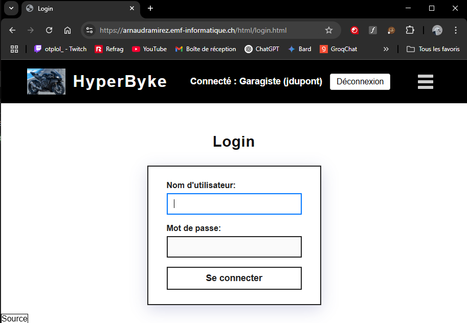

Screen test 2

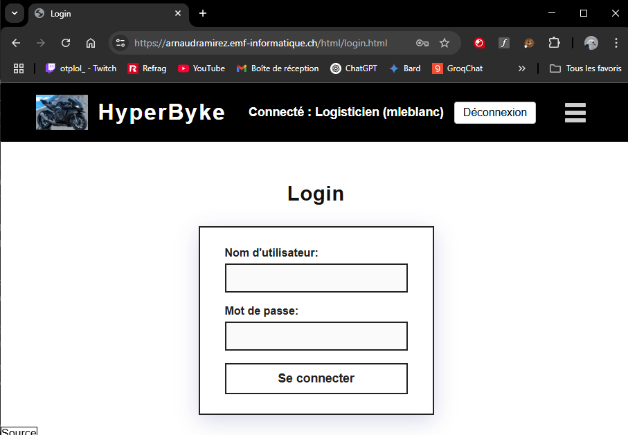

Screen test 3

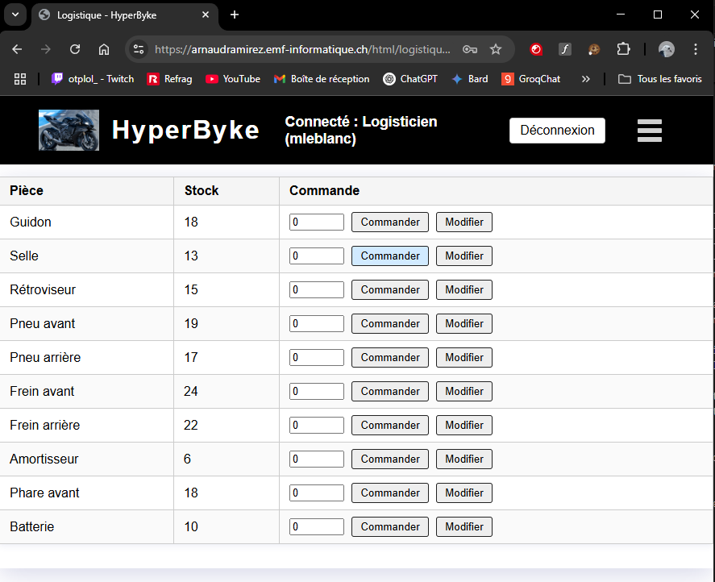
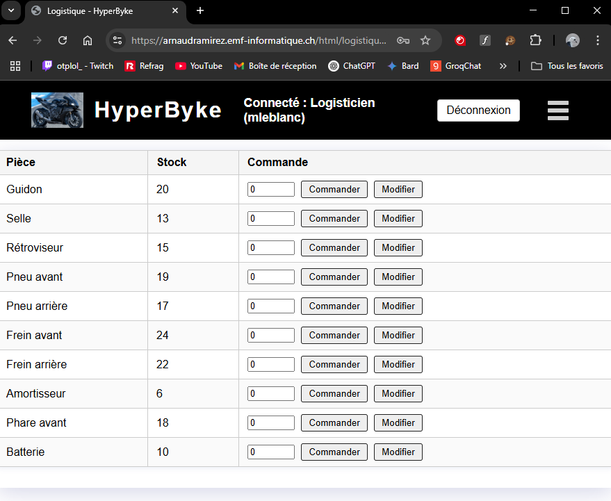

Screen test 4

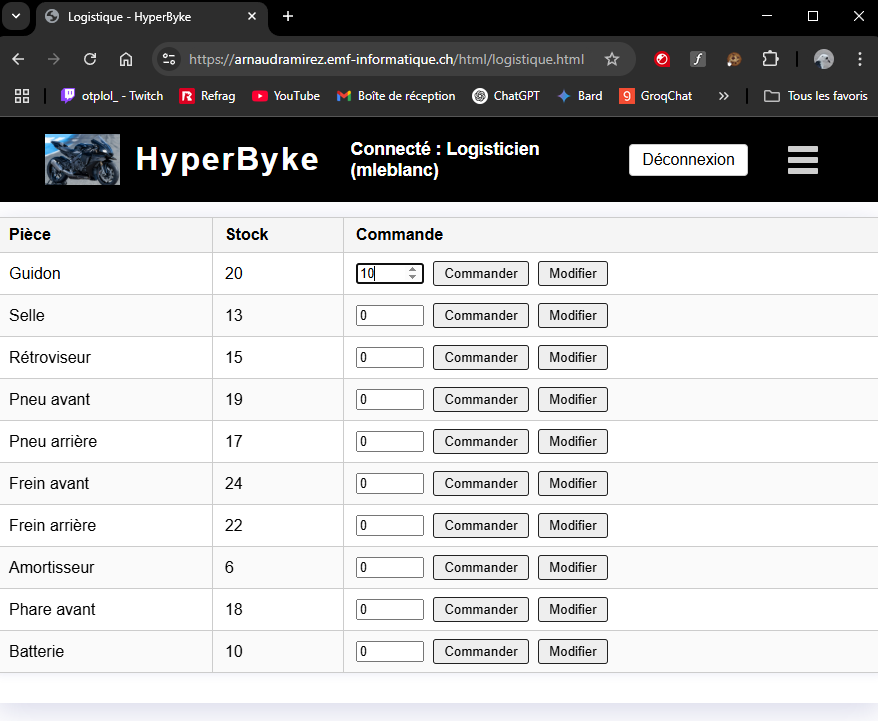
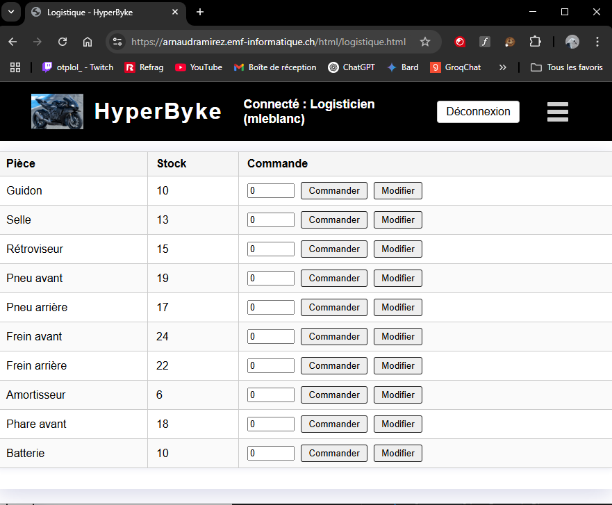

Screen test 5


Screen test 6


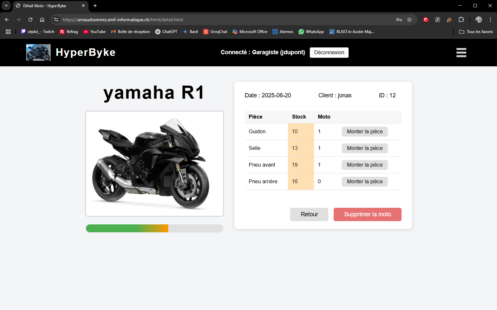

Screen test 7

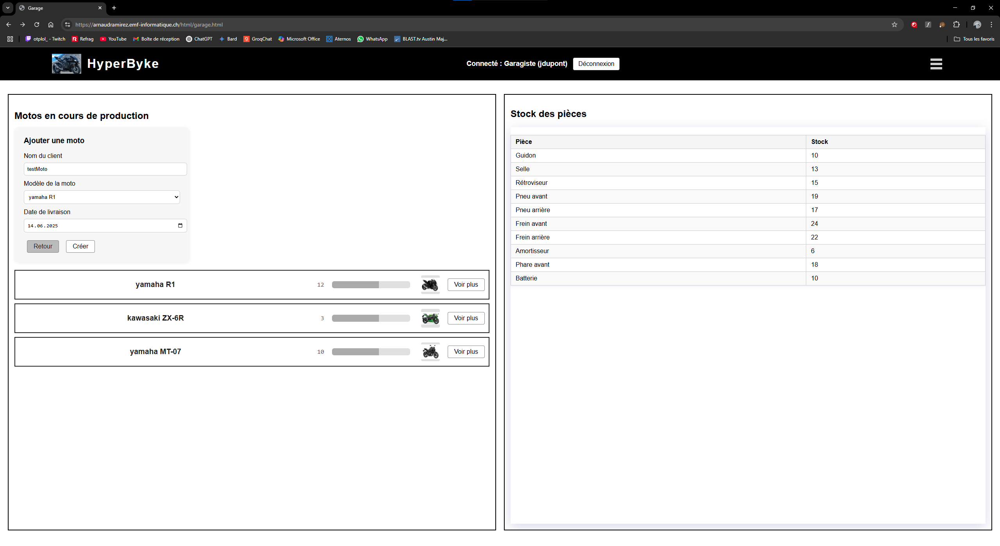
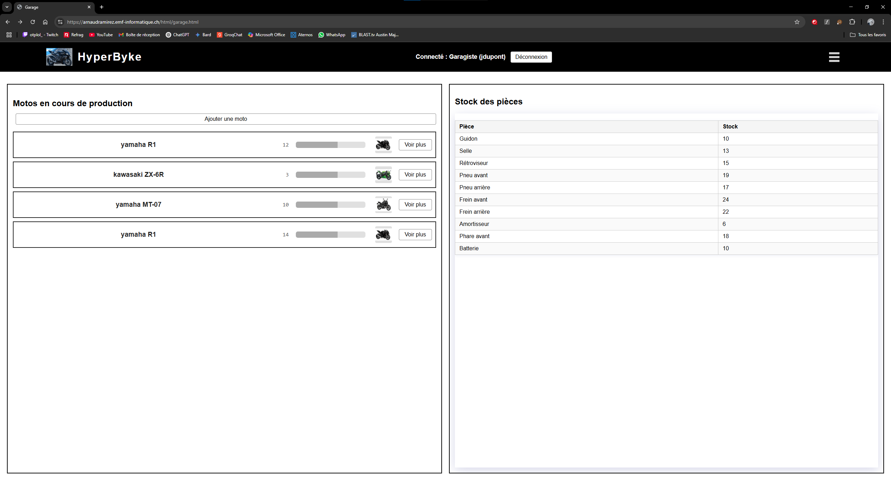

Screen test 8

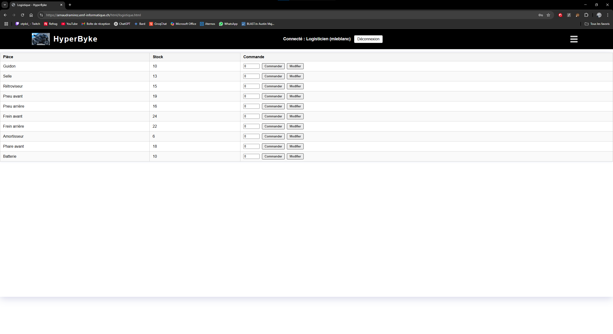

---

## Conclusion

In this project, I created a website with both a backend and frontend designed to manage a motorcycle garage, including inventory management and motorcycle production tracking. Everything works except for certain table colors and the progress bars for motorcycle assembly, which I did not have enough time to finalize. I believe the project is solid overall, but I could have organized my work better. I spent a significant amount of time creating the diagrams and documentation, which left me with less time to complete some implementation details. To improve my workflow, I should have planned my tasks more carefully and worked on the project outside of class hours, giving myself more time to develop and refine the application. This project was very interesting and helped me gain a deeper understanding of APIs, servers, frontend and backend development, as well as application deployment and hosting.


---

## Module 295 Conclusions – Testing and Software Quality

### What I liked

I really appreciated **Cypress** for functional testing. Seeing the browser open, being able to observe each action as if it were a real user, and watching tests pass in real-time is highly satisfying. You instantly understand what is happening and why a test fails.

I also very much liked the concept of **separating environments** with two distinct databases (production and testing). This is an approach I will inevitably encounter in the professional world as it avoids numerous issues.

Finally, **integration testing with Vitest** appealed to me because they actually test the real application: a true HTTP call to a real server with an actual database. We are sure the application works, not just that the code compiles.

### What I liked less

The hardest part was **configuring the Docker environment for testing**. When there is an error (like the wrong port or wrong SQL file), the error messages are not always clear, requiring lengthy investigation to locate the problem's source. For instance, the ECONNRESET error was caused by a simple `PORT: 3001` when it should have been `PORT: 3000` – this kind of configuration bug is very frustrating.

I also felt that testing documentation (HERMES testing concept, protocol) requires much rigor and time. Writing detailed test case tables with preconditions and expected results is necessary but tedious.

### What I learned

- **The testing pyramid** and why we have many unit tests, fewer integration tests, and very few E2E tests: it's a matter of speed, cost, and reliability.
- **The concrete difference** between **Jest** (unit tests, pure functions), **Vitest** (integration tests with HTTP), and **Cypress** (E2E tests in a real browser).
- **How to isolate a test environment with Docker**: a second database, a second server on a different port, initialized with controlled test data.
- **The importance of static analysis (ESLint)**: `no-var` and `eqeqeq` rules seem simple, but they avoid whole categories of bugs caused by JavaScript's peculiar behavior with types and scoping.
- **How to structure professional testing documentation** following the **HERMES** model, featuring a test concept (strategy, test case) and a protocol (dated results, interpretation, conclusions).

### Estimation of my own work

I consider my work on this module **adequate**. The 65 tests all pass (36 unit, 14 integration, 15 functional, 0 compliance violations) and the documentation is complete and structured.

Positive points:
- All tests run and cover the two main use cases.
- Environment separation is properly handled with a dedicated test database.
- Documentation follows the HERMES model requested in class.

Areas for improvement:
- Test coverage could be more extensive: I only tested 2 endpoints of the available routes (login and stock), omitting motorcycle routes.
- I could have written more integration tests covering a wider variety of edge cases (e.g., token expired, database error).
- With more time, I would have set up a CI/CD pipeline to automate test execution on each push.

Overall, I'd give myself a grade of **4/6**: the requested work is implemented and functional, but test coverage could have been more ambitious.
